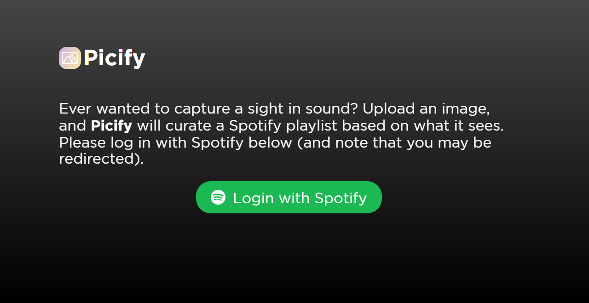
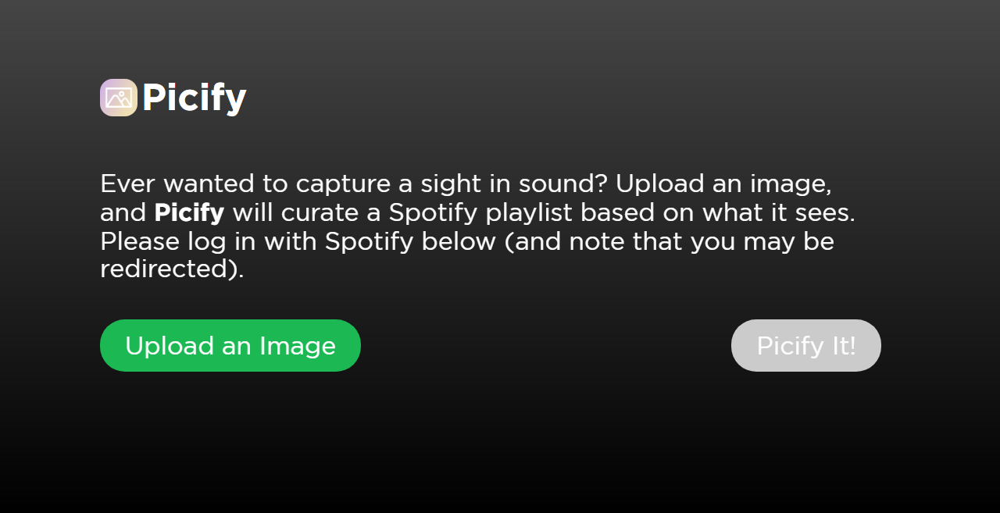
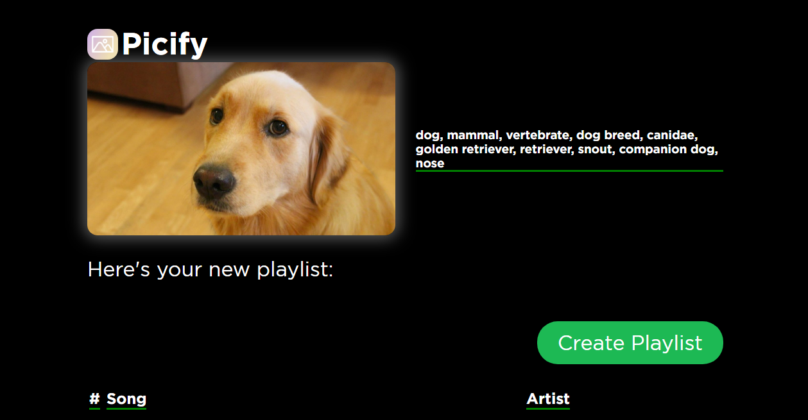
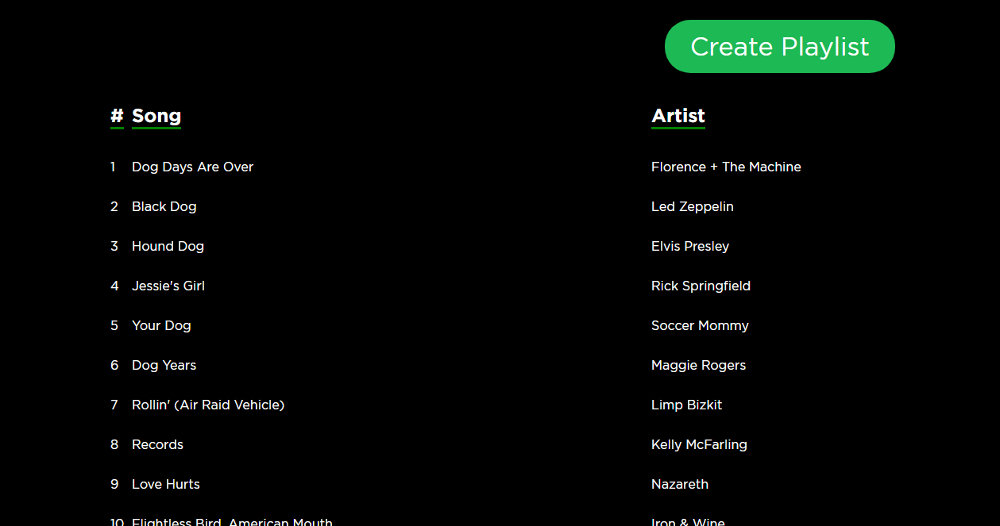

# :city_sunset: Picify :headphones:

**Picify** is a [Flask](http://flask.pocoo.org) web application that converts your photos into Spotify playlists that can be saved for later listening, providing a uniquely personal way to explore new music. Try it [here](http://picify.net/).

## Workflow

The main workflow for the app is as follows:

1. The user uploads a photo to the Picify Flask server.
2. The image is passed onto the [Google Cloud Vision](https://cloud.google.com/vision/) API, where labels and entities  are predicted/extracted. This information then gets passed back to the Flask server.
3. The labels and entities are filtered by a dynamic confidence threshold which is iteratively lowered until a large enough set of descriptors for the image can be formed.
4. Each of the descriptors in the above set are then expanded into associated "moods" using the [Datamuse API](https://www.datamuse.com/api/).
5. All of the descriptors and associated moods are filtered against a whitelist of "musically-relevant" terms compiled from sources such as [AllMusic](https://www.allmusic.com/moods) and [Every Noise at Once](http://everynoise.com/genrewords.html), excepting descriptors with extremely high confidence (for example, for a picture of Skrillex this might be "Skrillex").
6. Finally, the processed words are matched against existing Spotify playlists, which are sampled to form the final playlist.

## Contributors
- [Macguire Rintoul](https://github.com/mrintoul)
- [Matt Wiens](https://github.com/mwiens91)
- [Sophia Chan](https://github.com/schan27)

## Screenshots

